<b><h1>Inch Client</h1></b>
  <h4>Ignore the kinda weird name, it was from a random word generator</h4>

  
  <h2>About</h2>

This client is dedicated to the minecraft server <b><a href="http://en.wikipedia.org/wiki/2b2t" target="_blank">2 builders 2 tools (2b2t)</a>.</b>  
  2b2t is an anarchy server, which means there are no rules. This client is mainly focused on the PvP side of 2b2t, but includes many other features.  
Please note at the time of writing, that we will most likely only be making this for Minecraft version 1.12.2

<h2>Download Client</h2>

Inch Client is currenty in the making, but when ready to release, you can go to the Releases page, and select the version you want. Once downloaded, move the jar file to your mods in folder. View the pictures below for more detail.

<h4>Open up the folder where you downloaded the file:</h4>
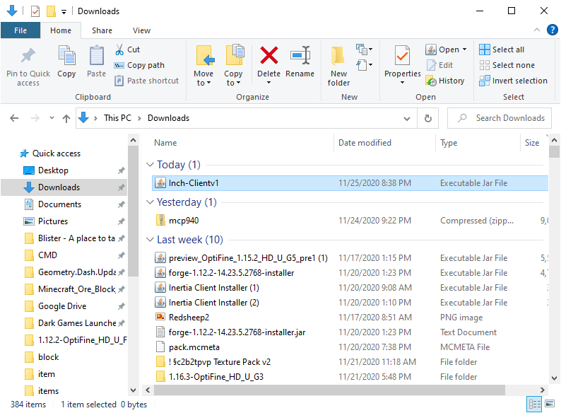
<h4>Press your <button>WINDOWS</button> key and your <button>R</button> at the same time. When a box pops up, type in "%appdata%"</h4>
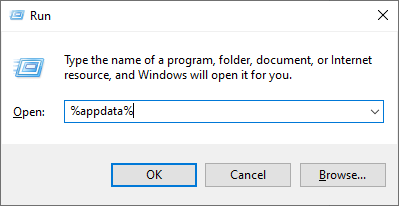
<h4>A new file explorer box should now pop up. Open the folder with the title ".minecraft"
  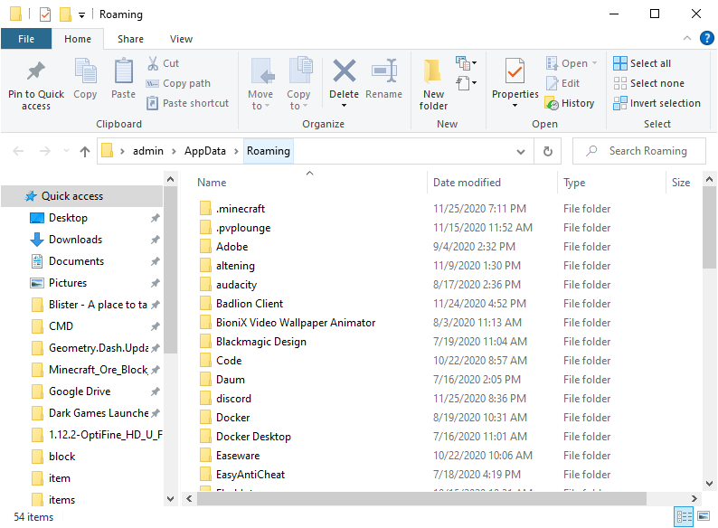
  <h4>When in the .minecraft folder, find and open the folder called "mods"</h4>
  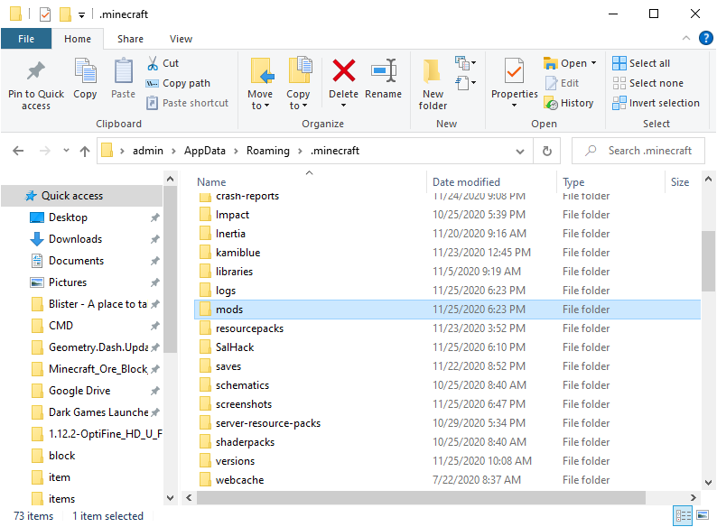
  <h4>Once in the mods folder, go back to the window where you downloaded the .jar file. Drag the file into your mods folder. Once in your mods folder it should look like this:</h4>
  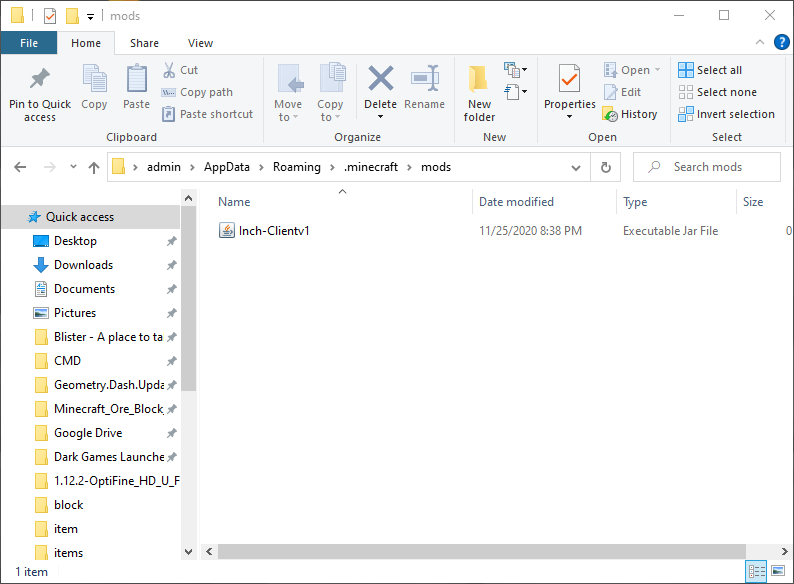
  

  <h2><b>Installing Forge</b></h4>
   
  <h4>Visit the forge website: <a href="http://files.minecraftforge.net/maven/net/minecraftforge/forge/index_1.12.2.html" target=_blank">Click Here</a>. When on the website, your page should look like this:</h4>
    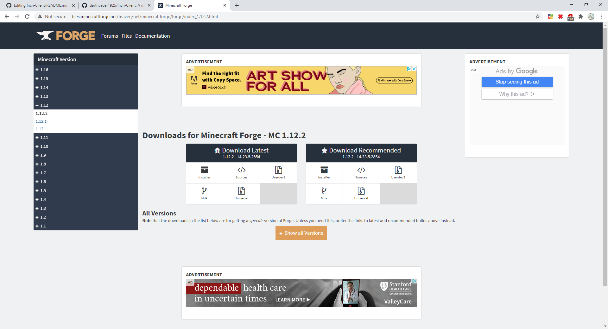
    
Once on the website, click the button that says "Installer"

    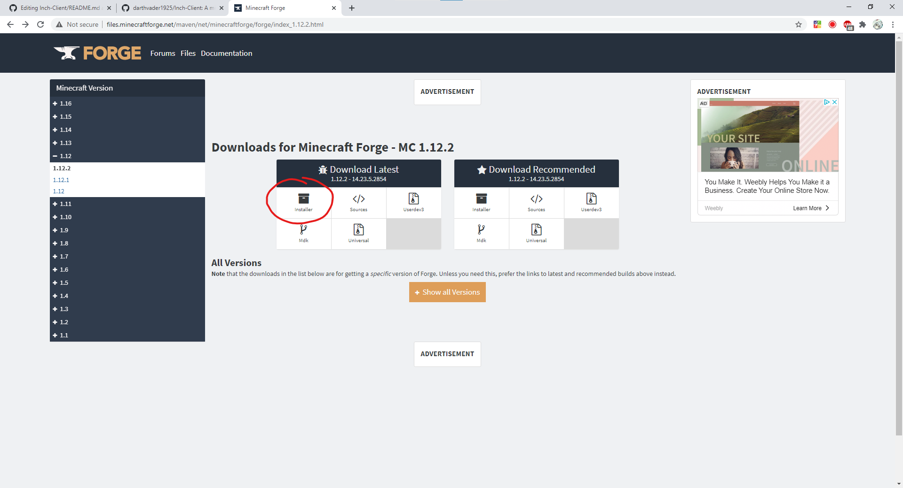
    <h4>Once you click the button, you will be redirected to a page. Don't click anything other then the "Skip" button. The file will then be downloaded</h4>
    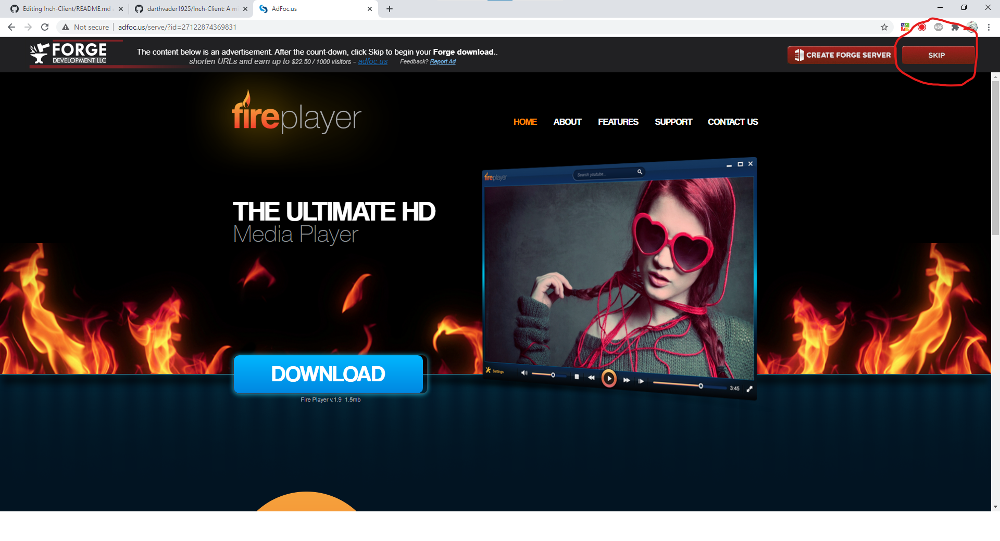
    <h4>Once the file has been downloaded, open the file. You will see a window popup that looks like this:</h4>
    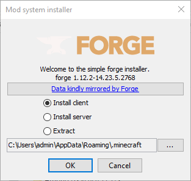
    <h4>Click on the checkbox that says "Install Client" and then press ok.</h4>
    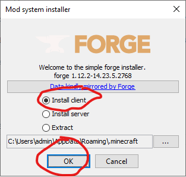
    <h4>After a few seconds you should see a Popup that says "Succesfully installed forge 1.12.2" or something related to that</h4>
    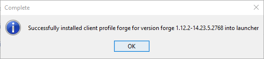
    <h4>Then you are complete! Open up your minecraft launcher and you should see a profile called "Forge 1.12.2"</h4>
    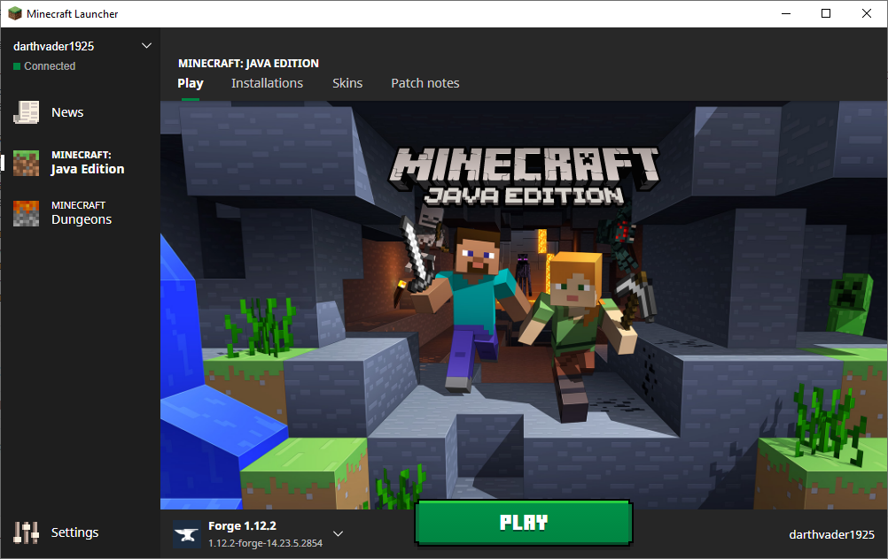

<h2>Contributers</h2>
<dl>
  <li><a href="https://github.com/darthvader1925">darthvader1925</a></li>
  <li><a href="https://github.com/teak4b">teak4b</a></li>
